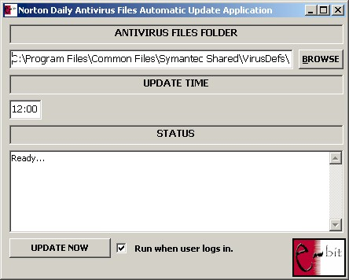



## Norton Daily Antivirus Definition Updater

### Description

Symantec's Live Update updates the virus definition files once a week. This is risky if a user is connected to and using internet all the time. Symantec also releases updates in a daily manner but they can only be downloaded and installed manually (Check Symantec's web site - www.symantec.com - for more information). This is not a practical solution. This application solves the update problem and automatically updates the virus definitions by checking for and downloading the updates each day.
 
### More Info
 
-Virus definition file folder

-Time to check updates

-Run after login or not

This code has a cool download form which was kindly supplied by another contributor of planetsourcecode.com. The code gets information from Symantec's web site in order to determine the file to download and if someday Symantec changes the address of that page it will fail to do so.

             |
---                |---
**Submitted On**   |2004-05-28 14:29:08
**By**             |[Yalin Meric](https://github.com/Planet-Source-Code/PSCIndex/blob/master/ByAuthor/yalin-meric.md)
**Level**          |Advanced
**User Rating**    |5.0 (15 globes from 3 users)
**Compatibility**  |VB 6\.0
**Category**       |[Miscellaneous](https://github.com/Planet-Source-Code/PSCIndex/blob/master/ByCategory/miscellaneous__1-1.md)
**World**          |[Visual Basic](https://github.com/Planet-Source-Code/PSCIndex/blob/master/ByWorld/visual-basic.md)
**Archive File**   |[Norton\_Dai1751955312004\.zip](https://github.com/Planet-Source-Code/yalin-meric-norton-daily-antivirus-definition-updater__1-54064/archive/master.zip)

